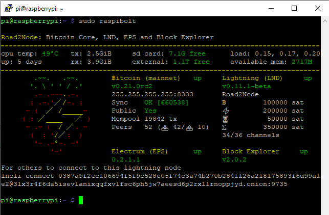


Tijd: 10 minuten



Onderstaande is niet noodzakelijk voor het opzetten van je node. Mocht je de guide volgen dan raad ik je aan om dit pas te doen als je Bitcoin, LND, Electrum en de Block Explorer hebt draaien.


Om bij het inloggen over SSH direct een overzicht te krijgen van de status van het systeem en 4 belangrijke services van je node kan je een shellscript toevoegen wat wordt uitgevoerd wanneer je inlogt. Deze handleiding is een bewerking van [Bonus Guide: System Overview](https://stadicus.github.io/RaspiBolt/raspibolt_61_system-overview.html) waarbij Electrs is vervangen door Electrum Personal Server. Daarnaast gaan we voor de versies van Bitcoin en LND uit van de laatste _getagde_ versie in Github en *niet* de latest release omdat we in deze handleiding uitgaan van de laatste tag.



```bash
sudo apt install jq net-tools
cd /tmp/
wget https://node.bitdeal.nl/.gitbook/assets/ssh-welcome-messsage.sh //Lex kan jij hier de juiste URL invoegen of aan mij doorgeven?
```

Check script en tweak.

```bash
nano ssh-welcome-messsage.sh
```

Pas nu de volgende regels aan:

```bash
# set blockexplorerip
blockexplorerip="IP-ADRES VAN PI"

#Set to mount point of blockchain volume. This is used to calculate USB HDD usage %
ext_hdd="/mnt/hdd"
```
Vervang in het commando IP-ADRES VAN PI met iets als 192.168.1.6. 

```bash
# delete existing welcome scripts and install
sudo mv /etc/update-motd.d /etc/update-motd.d.bak
sudo mkdir /etc/update-motd.d
sudo cp ssh-welcome-messsage.sh /etc/update-motd.d/
sudo chmod +x /etc/update-motd.d/ssh-welcome-messsage.sh
sudo ln -s /etc/update-motd.d/ssh-welcome-messsage.sh /usr/local/bin/show-welcome-message
```
Om te voorkomen dat je je Pi niet meer inkomt wanneer dit script gaat tweaken en er wellicht een foutje insluipt disablen we het script voor de `root` user.

```bash
sudo su
touch /root/.hushlogin
exit
```

Je kunt nu het welkomstbericht opvragen met `sudo show-welcome-message` en het wordt natuurlijk getoond als je inlogt met `pi`.
